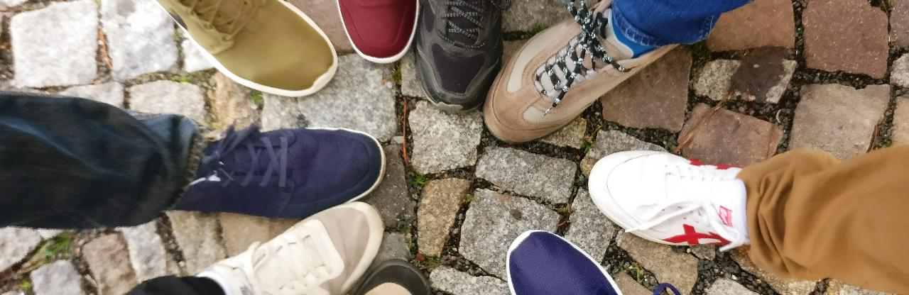

 Der Förderverein Kneipp-Kita Pfeffermäuse in Berlin ist ein anerkannt gemeinnütziger Verein und setzt sich aus ehrenamtlichen Helfern zusammen. Wir haben vor allem die finanzielle und ideelle Unterstützung der Kneipp-Kita Pfeffermäuse im Fokus und verwirklichen tolle neue Projekte für die Kinder. Seit seiner Gründung am 11.11.2002 konnte der Förderverein bereits viel zum Kneipp-Konzept und Kita-Alltag beitragen. Beispielsweise wurden durch den Förderverein...

- eine Sauna und eine Dusche beschafft
- ein Barfußpfad angelegt
- ein neuer Fahrradunterstand organisiert
- ein Barfußpfad und ein Klangpavillion angelegt
- mehrere Klettergerüste gebaut
- verschiedene Tische, Stühle und Bänke für die Kinder gekauft
- Sonnensegel über den Sandspielplätzen installiert
- eine Nestschaukel gebaut
- ein Trampolin gekauft (und erneuert)

Außerdem sind wir verantwortlich für die Organisation des jährlichen Sportfests und Unterstützung des Sommerfests.

Unsere Arbeit wird erst möglich durch die finanzielle Hilfe und Unterstützung unserer Mitglieder bei den Projekten, Basaren und Festen. Wir brauchen immer Unterstützung und Ideen, wie wir die Kita noch besser machen können. Deswegen suchen wir neue aktive Mitglieder! Wenn ihr Lust habt mit wenig Aufwand viel für unsere Kinder zu bewegen, seid ihr mehr als herzlich willkommen! 