Was für ein erfolgreicher Vormittag! Viele fleißige Helfer:innen haben gemeinsam angepackt und den Kita-Garten winterfest gemacht. 💪
Bäume und Sträucher wurden geschnitten, unzählige Blätter zusammengekehrt und ordentlich aufgeräumt – echte Teamarbeit vom Feinsten!

Zur Mittagszeit gab es für alle eine kleine Stärkung, damit auch der Endspurt noch geschafft werden konnte. Um 13 Uhr hieß es dann: Schicht im Schacht! Zwei riesige Container waren bis oben hin gefüllt und bereit zum Abtransport. 🚛🍂

Ein riesengroßes Dankeschön an alle Eltern, Kinder und Erzieher:innen, die mit angepackt haben – ihr wart großartig! ❤️

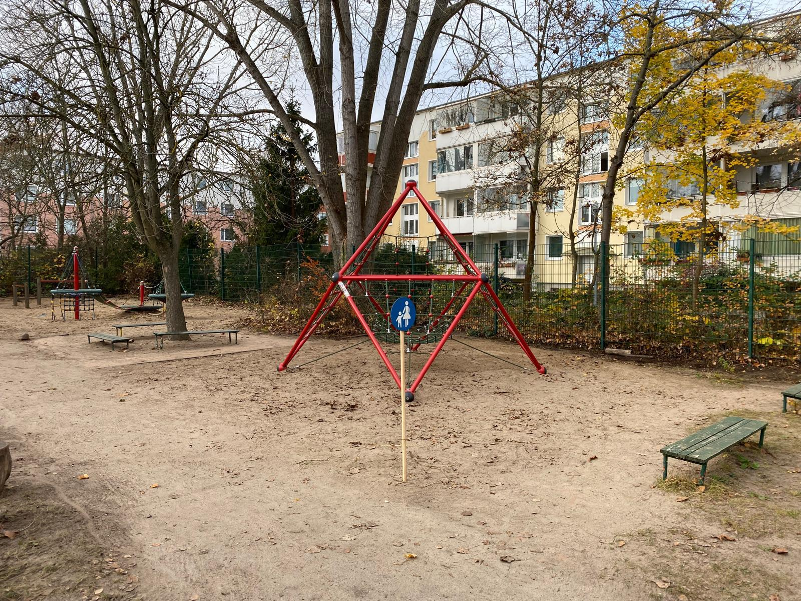
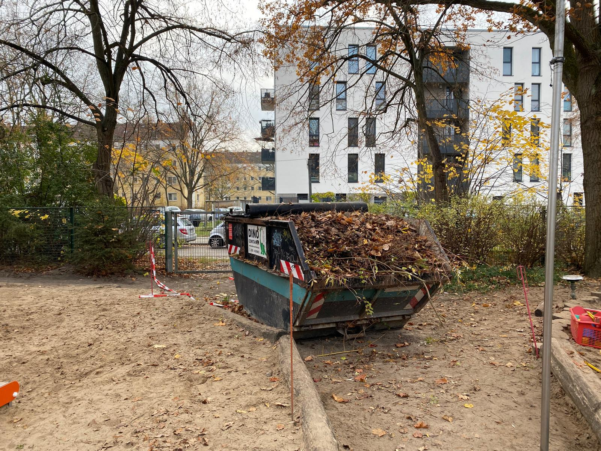
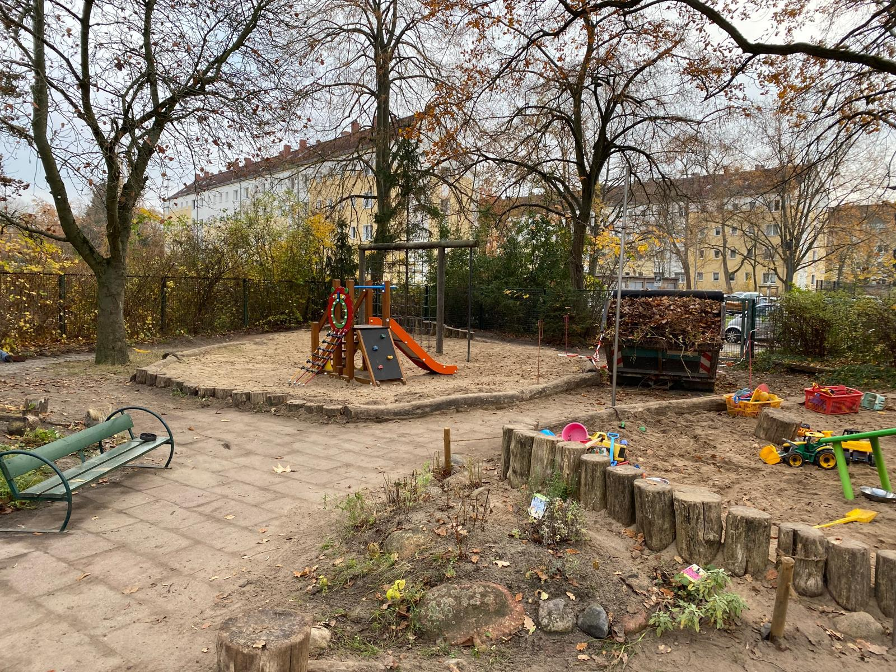
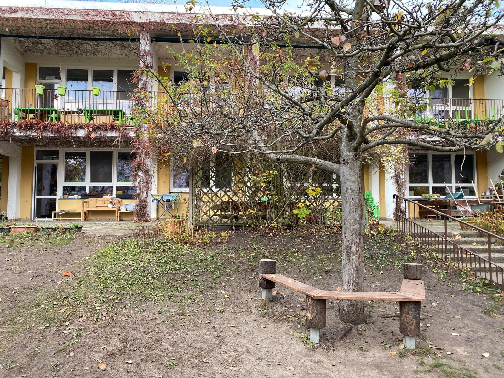
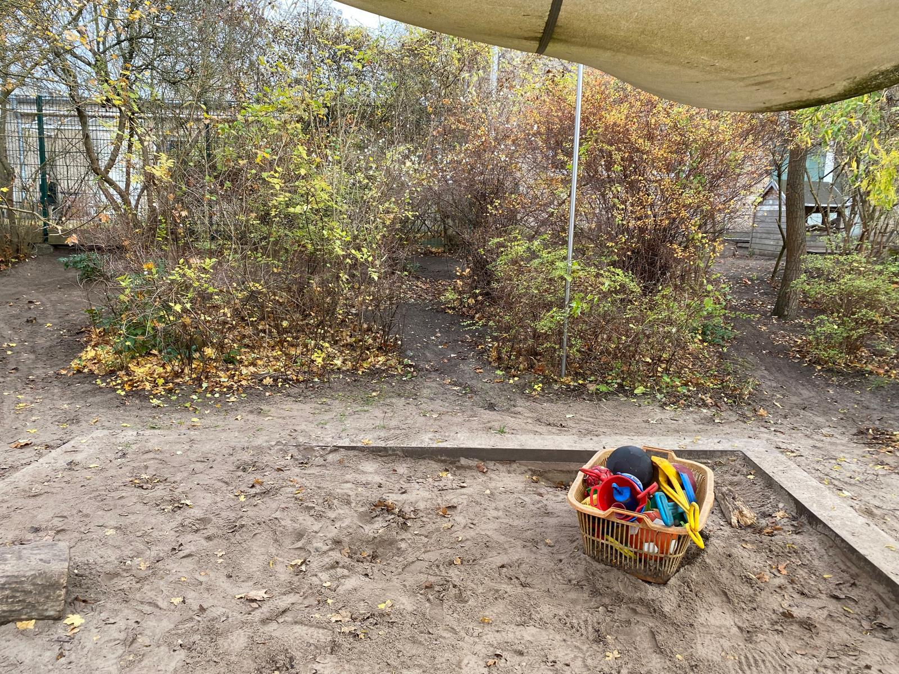
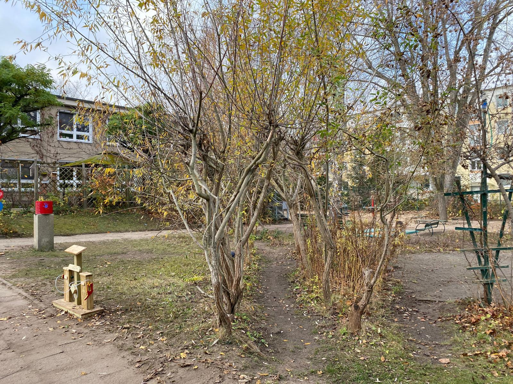
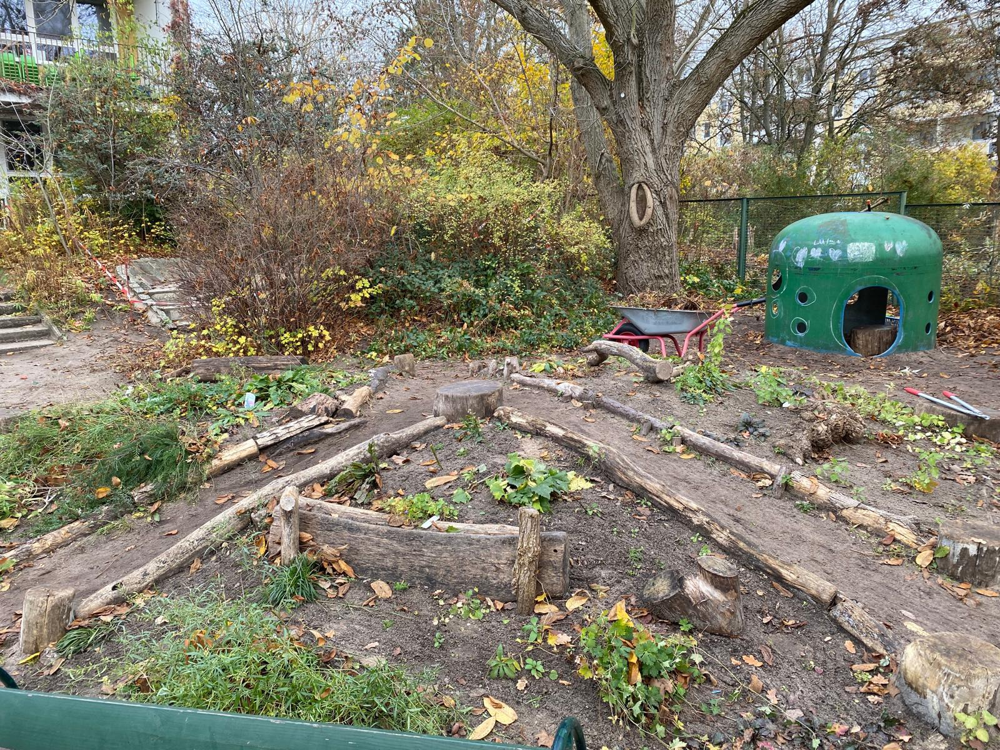
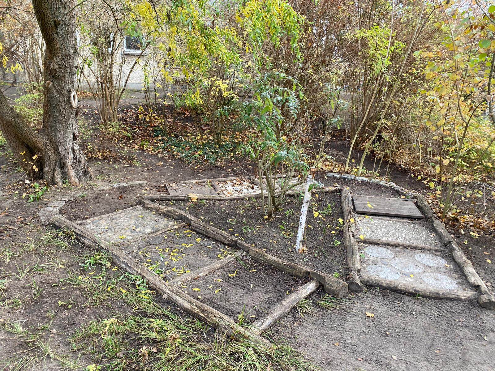

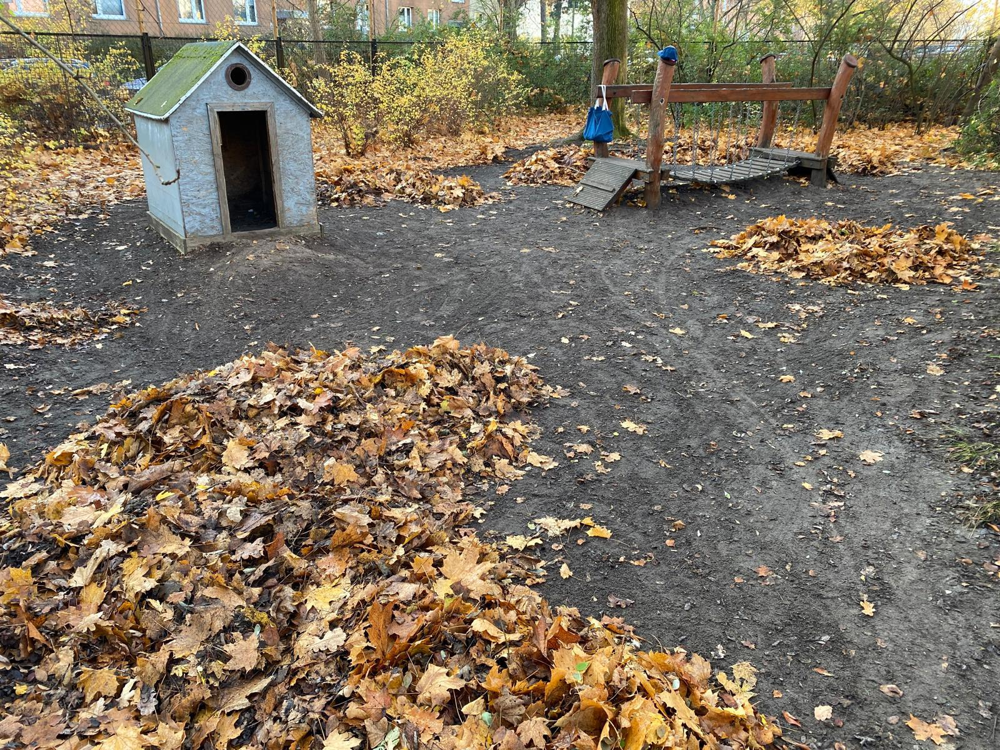
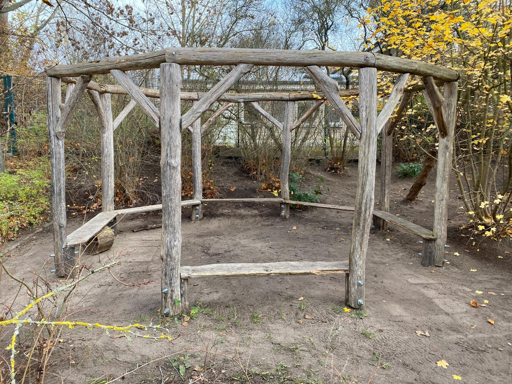
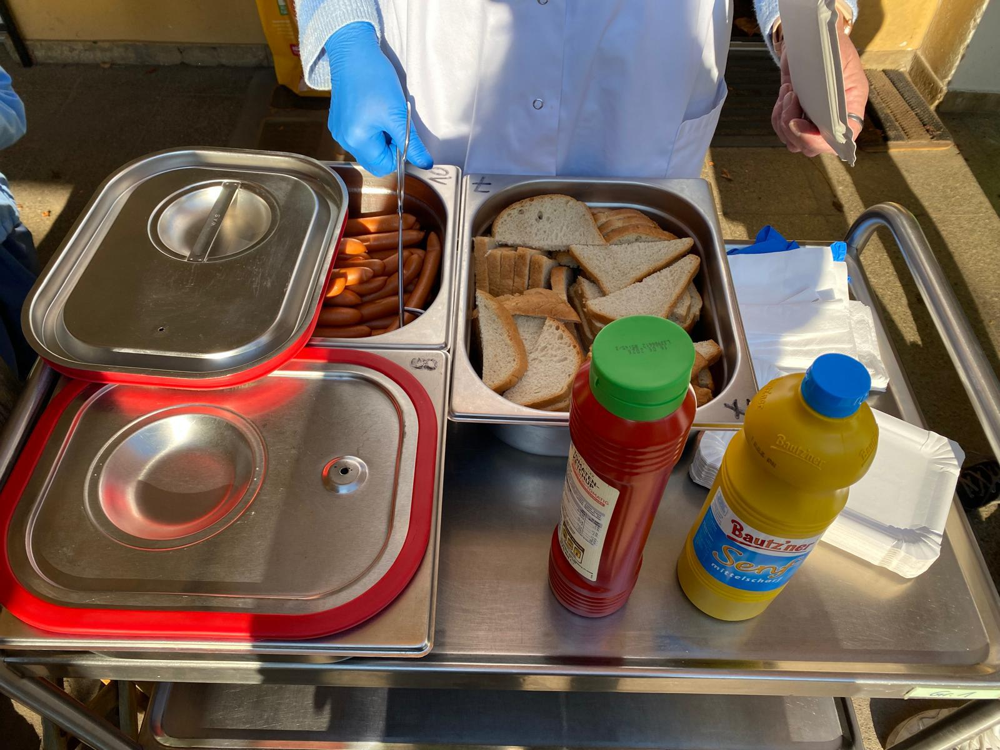
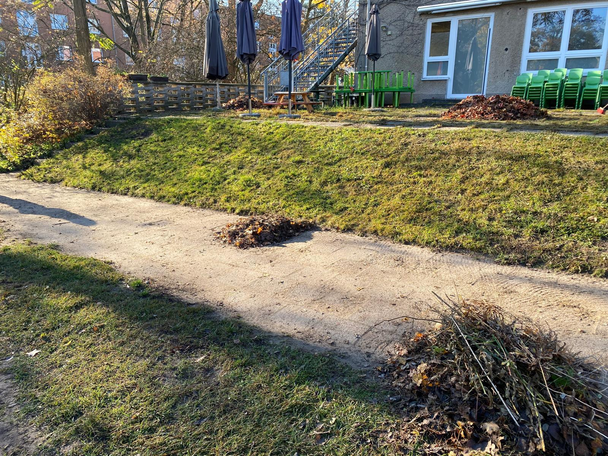
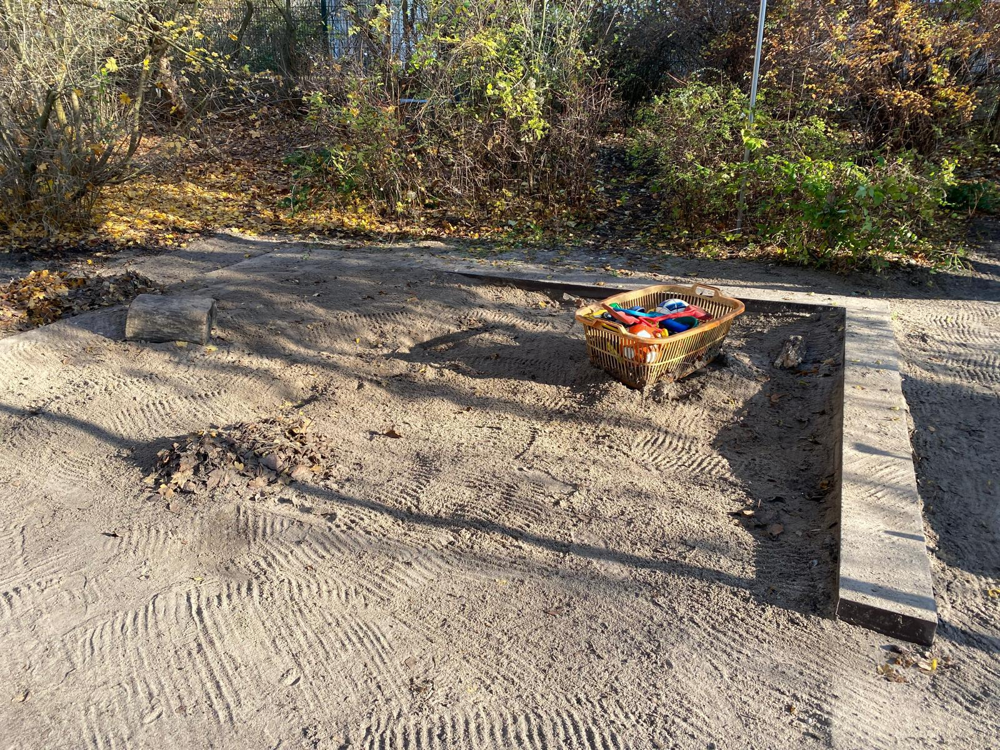
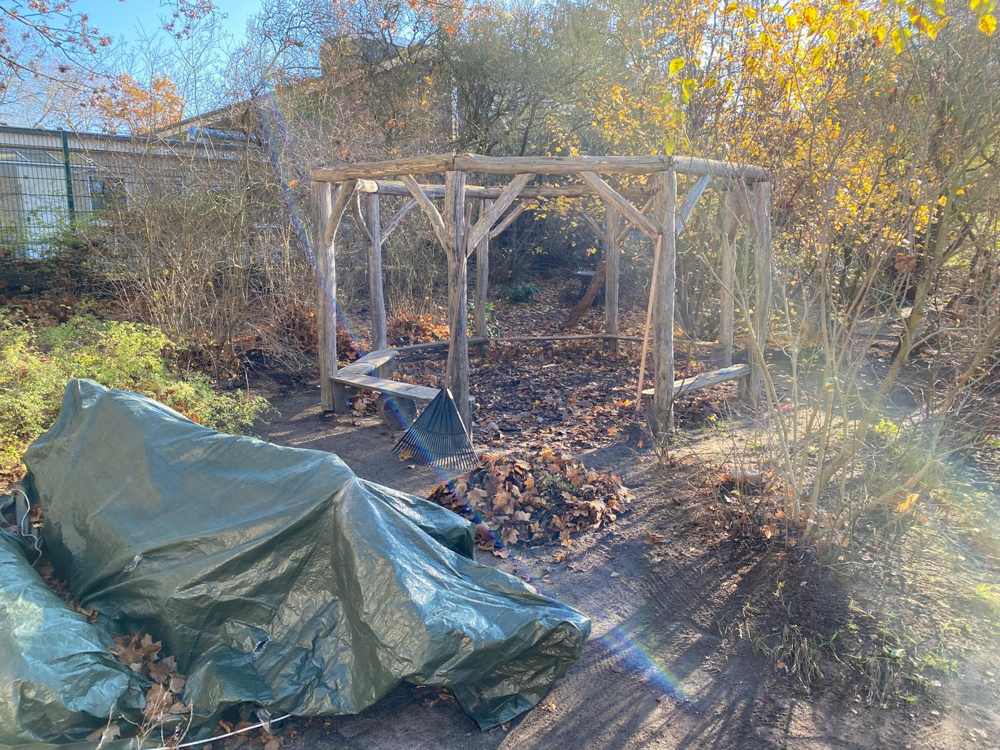