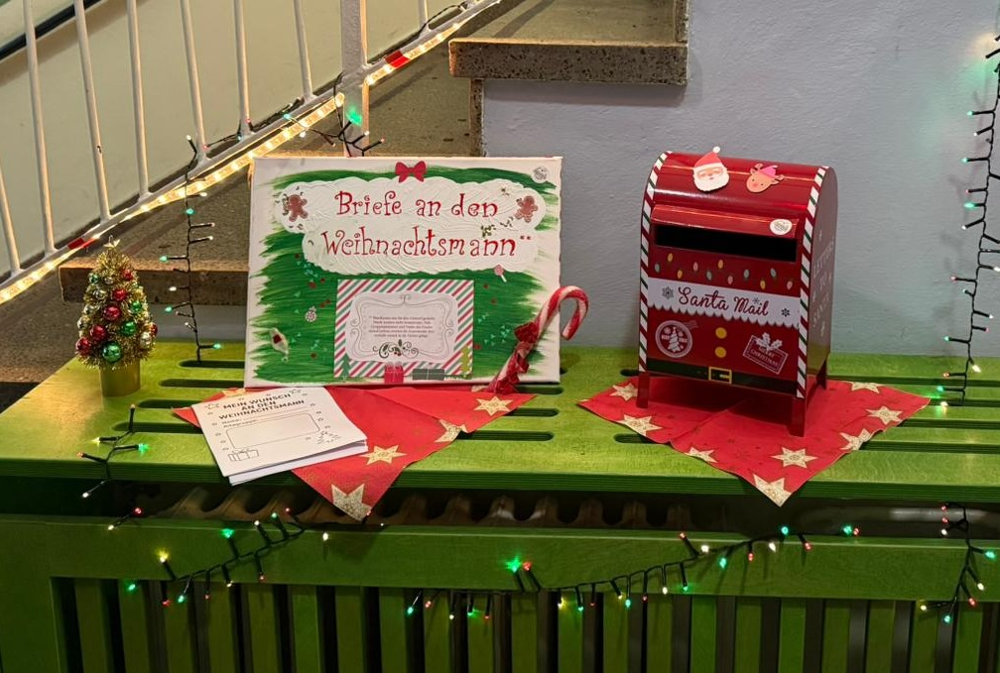
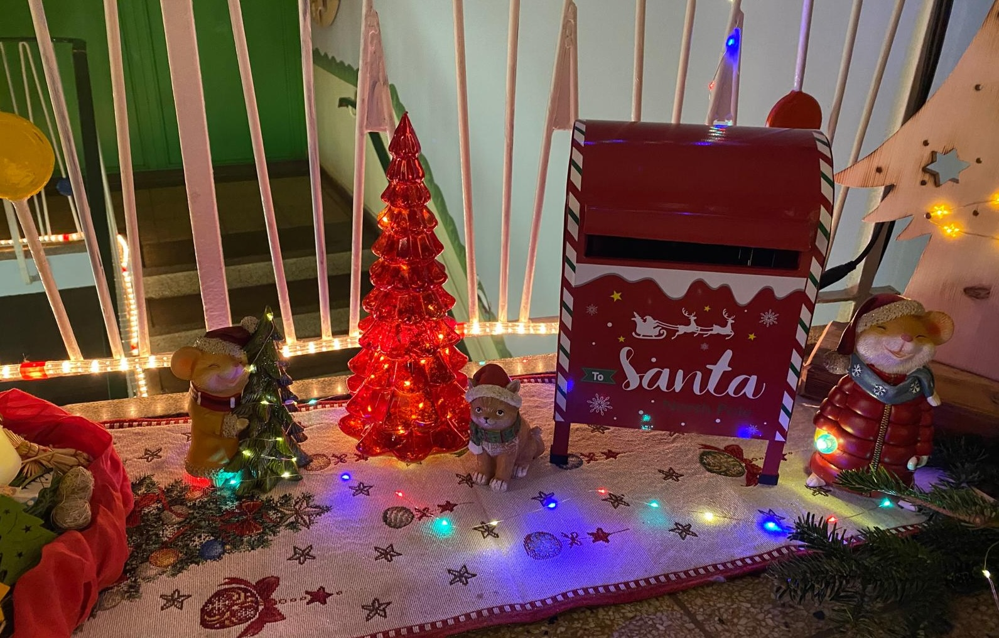

Im Dezember wird es in unserer Kita besonders spannend: sowohl in der Grünen Trift als auch in der Nachtheide stehen jeweils ein festlich geschmückter Briefkasten für den Weihnachtsmann! 🎅✨

Zwei Wochen lang können die Kinder dort ihre Briefe, Wunschzettel und Zeichnungen einwerfen – voller Fantasie, Hoffnung und Vorfreude. Eine Vorlage für den Wunschzettel wird am 03.12. zum Kuchenbasar ausgegeben. Am 17.12. werden die Briefkästen geleert und die Briefe finden am 19.12. ihren Weg zurück zu den Eltern. So haben sie vielleicht die Möglichkeit, den ein oder anderen Wunsch wahr werden zu lassen – und die Kinder zu Weihnachten besonders zum Strahlen zu bringen. 💛

Doch diese Aktion bedeutet noch mehr als Wünsche auf Papier: Die Kinder lernen spielerisch, dass man nicht immer sofort alles bekommt, was man sich wünscht – und dass Warten und Geduld Teil der Vorfreude sind.
Das Schreiben (oder Malen) an den Weihnachtsmann ist außerdem ein schönes Ritual, das Sprache, Kreativität und Fantasie fördert – und gleichzeitig den Zauber der Adventszeit lebendig hält.

🎄 Der Förderverein Pfeffermäuse e.V. freut sich, dass dieses kleine, herzliche Projekt jedes Jahr aufs Neue für leuchtende Augen sorgt – bei Klein und Groß.

