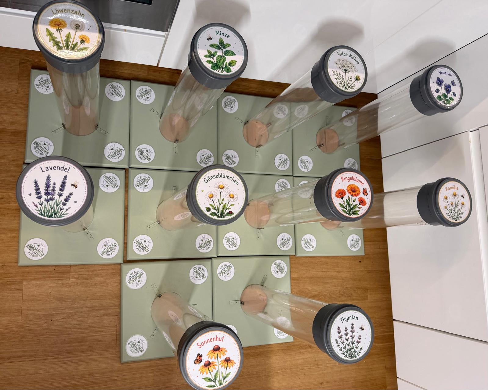

 

Oft sind es die kleinen Dinge, die am Ende etwas Großes möglich machen. ✨

Vom 05. bis 30. Oktober 2026 heißt es bei unseren Pfeffermäusen wieder:
Gemeinsam sparen für unsere Kinder! 🐭💰 Jede Kita-Gruppe hat ihre eigene Sparsäule, in die Kinder und Familien gemeinsam Kleingeld einwerfen können. Dabei wird es dieses Jahr besonders spannend:

🏆 Welche Gruppe wird Spar-Meister?

Am Ende unseres Spar-Monats wird nicht die Gruppe mit dem meisten Geld, sondern die Gruppe mit dem höchsten Sparsäulenstand in Zentimetern zum Spar-Meister gekürt.
Die Gewinnergruppe darf unseren Wanderpokal ein ganzes Jahr lang behalten – bis zum nächsten Spar-Monat. 🏆🐭

🎁 Gemeinsam erreichen wir mehr!

Unser gemeinsames Ziel sind 750 €. Wenn wir dieses Sparziel überschreiten, wartet eine Überraschung auf die gesamte Kita! 🎉

Und was diese Überraschung sein könnte, dürfen natürlich unsere Kinder und Familien mitentscheiden: Habt ihr eine tolle Idee? Dann werft euren Vorschlag einfach in einen unserer Vereinsbriefkästen.

Wir freuen uns auf zahlreiche kreative Vorschläge! 💡💛

🚌 Wofür wird gespart?

Mit dem Erlös möchten wir wieder ganz konkret etwas für unsere Kinder ermöglichen:
Wir möchten die gesamten Kosten für die Busfahrt unseres Kitaausflugs am 04.06.2027 übernehmen.

So wird aus vielen kleinen Münzen am Ende eine große Unterstützung für unsere Kita und ihre Kinder! ❤️

🛞 Unsere Sparsäulen sind jetzt noch besser unterwegs

Für den diesjährigen Spar-Monat haben wir unsere Sparsäulen auch optisch etwas aufgewertet – und ihnen sogar Rollen spendiert. 😊 Denn eines wird schnell deutlich: Wenn jeden Tag fleißig gespart wird, werden die Säulen mit der Zeit ganz schön schwer! 😄 Dank der Rollen können die Erzieherinnen und Erzieher uns dabei unterstützen, die gefüllten Sparsäulen am Ende des Kita-Tages leichter an einem sicheren Ort zu verwahren.

Ein herzliches Dankeschön schon jetzt an alle Familien, Kinder und das Kita-Team, die unseren Spar-Monat unterstützen. 🧡

Denn am Ende gilt: Viele kleine Münzen können gemeinsam richtig viel bewegen! 💰✨

Euer
Förderverein Kneipp-Kita Pfeffermäuse e.V. 🐭🩶

